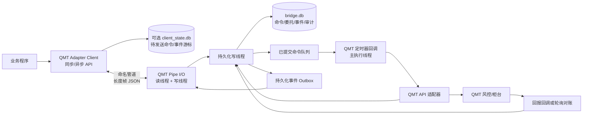

# QMT Adapter 交易桥接系统设计

> 当前实现阶段说明（2026-08-20）：当前协议 v2 已实现普通股票账户、持仓、
> 买卖、委托查询、撤单、下单幂等，以及盘口流动性加权算法父单。算法执行、
> 持久化和重试的当前权威设计见 `QMT_ALGO_ORDER_DESIGN.md`。实现中不再设置独立
> `idempotency_key`；`client_order_id` 是逻辑委托 ID，也是唯一的下单幂等
> 身份。相同 ID 与相同规范化参数重放已有结果，相同 ID 与不同参数返回
> `CLIENT_ORDER_ID_CONFLICT`，不确定边界返回 `COMMAND_UNCERTAIN` 且不自动
> 重下。本文其余仍提到独立 `idempotency_key`、UUIDv7、Outbox 或幂等撤单的
> 段落属于后续架构草案，不代表当前公开 API；当前用法以
> `QMT_ADAPTER_FUNCTION_GUIDE.md` 为准。

> 文档状态：设计草案 v1  
> 目标环境：平安证券量盈 QMT 策略交易平台（本机 `XtMiniQmt.exe` 2.1.17.0，内置 Python 3.6.8）  
> 当前实现范围：单机 Windows、单个 QMT 实例、单个活动客户端、普通现金股票账户/持仓/买卖/委托查询/撤单  
> 通信方式：Windows 命名管道，全双工、长度帧、UTF-8 JSON

## 1. 设计目标

系统由两个边界清晰的部分组成：

1. **QMT 端桥接策略（QMT Bridge）**：运行在 QMT Python 模型中，是唯一允许调用 QMT 函数的组件。它接收统一命令，在 QMT 调度线程中执行 `passorder`、`cancel`、`get_trade_detail_data` 等函数，并将标准化结果返回外部。
2. **外部封装交易库（QMT Adapter Client）**：普通 Python 包，不导入、不调用、不感知任何 QMT 函数。它只理解统一的数据模型和命名管道协议，为业务程序提供同步、异步、查询、订阅和恢复接口。

核心目标：

- 外部调用方不依赖 QMT API、`ContextInfo`、QMT Python 版本或 QMT 数据对象。
- 下单调用立即获得稳定、可查询的 `client_order_id`。
- 在 QMT 后续产生柜台委托号后，将其关联为 `qmt_order_id`。
- 同一幂等键重复发送时不重复执行交易指令。
- QMT、客户端或管道异常重启后能够恢复命令状态和委托映射。
- 同时支持同步等待、异步提交和状态事件订阅。
- 所有写操作可审计，所有不确定结果显式标记，绝不把超时等同于失败并盲目重试。

## 2. 非目标与明确限制

首期不包含：

- 历史行情下载、因子计算、回测和策略信号生成。
- 跨机器通信；命名管道只服务于同一台 Windows 主机。
- 多 QMT 实例自动路由；首期一个管道对应一个 QMT 实例。
- 账号组和组合篮子交易；一个统一下单请求只产生一个逻辑委托。
- 对 QMT 外部副作用提供数学意义上的 exactly-once 保证。

最后一点必须明确：`passorder()` 返回 `None`，SQLite 提交和 QMT 下单调用无法组成同一个原子事务。因此，如果进程恰好在 QMT 已接收下单、但本地尚未写入“调用完成”状态时崩溃，只能通过投资备注、委托回报和查询进行恢复，不能安全地直接重下。系统提供的是：

- 命令接收与持久化的 exactly-once；
- 正常运行期间的幂等执行；
- 崩溃窗口内的“先对账、绝不自动重下”；
- 最终达到 effectively-once 的业务效果。

## 3. 已核对的 QMT 能力与约束

本机实测 QMT 内部 Python 可使用文件、SQLite WAL、TCP、Windows 命名管道、命名内存映射和线程。实际 QMT 模型中的命名管道往返中位数约 20.8 微秒，但交易命令总延迟还会受到 QMT 定时器、QMT 风控和柜台响应影响。

QMT 手册提供的主要接口如下：

| 能力 | QMT 接口 | 关键约束 |
|---|---|---|
| 综合下单 | `passorder(...)` | 无返回值；可传 `strategyName`、`quickTrade`、`userOrderId` |
| 交易明细查询 | `get_trade_detail_data(...)` | 支持 `ACCOUNT`、`POSITION`、`ORDER`、`DEAL`、`TASK` |
| 按委托号查询 | `get_value_by_order_id(...)` | 返回 QMT `PythonObj` |
| 最新委托号 | `get_last_order_id(...)` | 并发情况下存在串单风险，不能作为主要关联方法 |
| 可撤判断 | `can_cancel_order(...)` | 只表示当前查询时是否可撤 |
| 撤单 | `cancel(...)` | 返回值只表示是否发出撤单信号，不表示撤单最终成功 |
| 算法任务管理 | `cancel_task`、`pause_task`、`resume_task` | 依赖 QMT 任务 ID |
| 周期调度 | `ContextInfo.run_time(...)` | 支持毫秒周期；策略结束时定时器结束 |
| 委托/成交关联 | `m_strRemark`、`m_strOrderSysID` | `userOrderId` 可从委托/成交对象的备注字段取回；委托和成交共用委托号 |

重要运行约束：

- QMT Python 模型必须包含 `init(ContextInfo)` 和 `handlebar(ContextInfo)`。
- 交易函数应由 QMT 自己的模型/定时器线程调用，后台管道线程不得直接调用 QMT API。
- `quickTrade=1` 只应在最新非历史 Bar 上使用；桥接程序禁止使用 `quickTrade=2`，避免历史 Bar 重放时下单。
- QMT 的“模拟信号模式”和“模拟资金账号”不是同一概念。模拟信号模式会在客户端截断交易函数。若要把委托发送到模拟柜台，应使用模拟账号，并让模型处于能够向柜台发送信号的运行模式。
- QMT 返回的是动态 `PythonObj`，不同券商版本字段可能有差异，必须通过版本适配器和启动能力探测转换，不能让对象泄漏到外部协议。

## 4. 总体架构



### 4.1 QMT Bridge 内部模块

| 模块 | 职责 |
|---|---|
| `BridgeLifecycle` | `init/stop` 生命周期、健康状态、关闭线程 |
| `PipeServer` | 创建 `\\.\pipe\qmt_adapter_v1`、鉴权、重连、帧收发 |
| `ProtocolCodec` | 长度帧、JSON 校验、协议版本、消息大小限制 |
| `CommandStore` | SQLite 事务、幂等检查、命令状态、委托映射、Outbox |
| `CommandDispatcher` | 在 QMT 定时器线程中限量执行已持久化命令 |
| `QmtApiAdapter` | 统一模型到 QMT 参数/对象的唯一映射层 |
| `Reconciler` | 委托/成交/持仓轮询、回调合并、重启恢复 |
| `RiskGuard` | 账号白名单、数量/金额/频率等本地保护 |

### 4.2 外部交易库模块

| 模块 | 职责 |
|---|---|
| `QmtClient` | 同步连接、调用、等待和查询 |
| `AsyncQmtClient` | `asyncio` 形式的异步调用和事件流 |
| `OrderService` | 统一下单、撤单、委托查询 |
| `AccountService` | 账号、资产和持仓查询 |
| `TradeService` | 成交查询和事件订阅 |
| `ClientOutbox` | 可选的调用方持久化，支持进程崩溃后重发同一幂等请求 |
| `Models` | 与 QMT 无关的 dataclass/枚举/异常类型 |

外部库不得包含 `passorder`、`ContextInfo` 或任何 QMT 动态对象引用。

## 5. 并发模型与 QMT 调度

QMT Bridge 采用以下线程规则：

1. **管道线程**按“客户端先写请求、再读响应”的方式串行处理同一连接；交易和 QMT 查询命令进入 QMT 主线程队列。
2. QMT 主线程完成普通命令后直接向同一管道写响应；等待委托号的下单请求保持挂起，由 `order_callback` 写回最终响应。
3. 当前实现只有 QMT Bridge 写 `bridge.db`，外部库不通过 SQLite 传递实时响应；SQLite仅记录委托状态并用于恢复。
4. **QMT 执行线程**由 `ContextInfo.run_time()` 定时回调驱动，是唯一调用 QMT API 的线程。
5. QMT 的委托/成交回调只做对象快照、更新线程安全内存缓存并入队，不进行阻塞 I/O。

当前平安 QMT 构建已实测支持 `10nMilliSecond`，定时器实际间隔中位数约
10毫秒。每次最多处理20条命令，避免单个周期长时间占用 QMT 主线程。算法状态机
不使用 `sleep`，而是在同一定时器中按到期时间推进。

启动阶段必须经过以下门禁后才能执行写命令：

- SQLite 打开和迁移成功；
- 命名管道服务启动成功；
- 配置的账号完成 `ContextInfo.set_account()` 订阅；
- QMT 已进入最新 Bar，`ContextInfo.is_last_bar()` 为真；
- 请求中的环境与桥接环境相符。

否则查询可以按能力返回，交易命令返回 `QMT_NOT_READY`。

## 6. 命名管道协议

### 6.1 管道与连接模型

- 默认名称：`\\.\pipe\qmt_adapter_v1`
- QMT Bridge 是管道服务端，外部交易库是客户端。
- 首期只允许一个活动客户端；第二个客户端得到 `CLIENT_BUSY`。
- 断开后 QMT 端重新创建管道实例，客户端指数退避重连。
- 管道使用字节模式和 Overlapped I/O；不依赖消息模式。
- 一条逻辑消息采用 `4 字节大端无符号长度 + UTF-8 JSON`。
- 最大消息长度默认 1 MiB；超过限制立即断开并记录安全审计。
- 每个连接只有一个读循环和一个写循环；业务线程不得直接读写句柄。

字节模式配合显式长度帧可以规避消息模式下 `ERROR_MORE_DATA`、读模式设置和大消息分片差异。

### 6.2 握手

客户端连接后首先发送：

```json
{
  "v": 1,
  "type": "hello",
  "message_id": "0198f2d0-8b73-7a21-9a52-3e3c4af9c001",
  "client_id": "strategy-engine-01",
  "client_version": "0.1.0",
  "supported_versions": [1],
  "auth_token": "<从受限配置文件读取>",
  "last_event_seq": 1024,
  "environment": "SIMULATION"
}
```

服务端返回协议版本、`bridge_instance_id`、QMT 版本、Python 版本、账号能力、最大消息大小和支持命令。客户端必须依据能力协商结果工作，不能假设所有券商版本支持相同字段。

### 6.3 请求信封

```json
{
  "v": 1,
  "type": "request",
  "message_id": "0198f2d0-8b73-7a21-9a52-3e3c4af9c002",
  "request_id": "0198f2d0-8b73-7a21-9a52-3e3c4af9c003",
  "idempotency_key": "strategy-a:20260819:signal-381",
  "command": "order.place",
  "created_at": "2026-08-19T11:30:00.123+08:00",
  "deadline_at": "2026-08-19T11:30:10.123+08:00",
  "payload": {}
}
```

规则：

- `message_id` 标识一次传输，可因重连而变化。
- `request_id` 标识一次逻辑调用，重发时不变。
- 所有有副作用命令必须有 `idempotency_key`。
- 服务端对规范化后的 `command + payload` 计算 SHA-256。
- 相同幂等键、相同哈希：返回原命令当前状态，不重新执行。
- 相同幂等键、不同哈希：返回 `IDEMPOTENCY_CONFLICT`。
- `deadline_at` 只限制是否开始执行；一旦 QMT 调用已经发生，不因客户端超时而撤销或重试。

### 6.4 响应与事件

```json
{
  "v": 1,
  "type": "response",
  "message_id": "0198f2d0-8b73-7a21-9a52-3e3c4af9c004",
  "request_id": "0198f2d0-8b73-7a21-9a52-3e3c4af9c003",
  "ok": true,
  "code": "ACCEPTED",
  "result": {},
  "error": null,
  "server_time": "2026-08-19T11:30:00.150+08:00"
}
```

事件包含单调递增的 `event_seq`。客户端重连时提交最后确认的序号，服务端从事件日志重放。事件至少包括：

- `command.updated`
- `order.updated`
- `trade.created`
- `account.updated`
- `position.updated`
- `bridge.health_changed`

心跳间隔建议 5 秒，15 秒未收到对端活动则断开重连。

## 7. 首期命令目录

### 7.1 系统命令

| 命令 | 说明 |
|---|---|
| `system.health` | QMT、管道、数据库、调度器、账号订阅和对账状态 |
| `system.capabilities` | 支持的命令、账号类型、价格模式和字段版本 |
| `system.mode` | 返回 `READ_ONLY`、`SIMULATION` 或 `LIVE`；不可通过远程命令开启实盘 |
| `reconcile.run` | 手动触发一次委托/成交/持仓对账 |

### 7.2 查询命令

| 命令 | QMT 映射 | 结果 |
|---|---|---|
| `account.list` | 配置账号 + `ACCOUNT` 查询 | 账号摘要列表 |
| `account.get` | `get_trade_detail_data(..., "ACCOUNT")` | 资产、可用资金、状态 |
| `position.list` | `get_trade_detail_data(..., "POSITION")` | 标准化持仓列表 |
| `order.get` | 本地映射；必要时 `get_value_by_order_id` | 单个委托 |
| `order.list` | `get_trade_detail_data(..., "ORDER")` | 委托列表 |
| `trade.list` | `get_trade_detail_data(..., "DEAL")` | 成交列表 |
| `task.list` | `get_trade_detail_data(..., "TASK")` | 算法任务列表 |

列表查询支持 `limit`、`cursor`、`updated_since`、证券代码和状态过滤。单次上限默认 500 条，避免管道大消息和 QMT 长时间序列化。

### 7.3 写命令

| 命令 | QMT 映射 | 语义 |
|---|---|---|
| `order.place` | `passorder` | 普通股票、信用和期货下单 |
| `order.cancel` | `can_cancel_order` + `cancel` | 发出撤单请求，随后等待状态回报 |
| `task.cancel` | `cancel_task` | 撤销算法任务 |
| `task.pause` | `pause_task` | 暂停算法任务 |
| `task.resume` | `resume_task` | 恢复算法任务 |

首期不提供“修改委托”；统一表达为撤单成功后使用新的幂等键提交新委托。

## 8. 统一下单模型

### 8.1 `OrderRequest`

```json
{
  "client_order_id": "0198f2d0-8b73-7a21-9a52-3e3c4af9c010",
  "account_id": "<资金账号>",
  "account_type": "STOCK",
  "instrument": "600000.SH",
  "side": "BUY",
  "business_type": "CASH",
  "position_effect": "DEFAULT",
  "quantity_type": "SHARES",
  "quantity": 100,
  "price_type": "LIMIT",
  "limit_price": 9.04,
  "remark": "策略A首次开仓",
  "strategy_tag": "strategy-a",
  "risk": {
    "max_slippage_bps": 50
  }
}
```

字段定义：

| 字段 | 要求 |
|---|---|
| `client_order_id` | 外部库生成 UUIDv7；调用方可指定，但必须全局唯一 |
| `account_id` | 必填，且必须在 QMT Bridge 白名单内 |
| `account_type` | `STOCK`、`CREDIT`、`FUTURE`、`STOCK_OPTION`、`HUGANGTONG`、`SHENGANGTONG` |
| `instrument` | `code.market` 格式，例如 `600000.SH` |
| `side` | `BUY` 或 `SELL` |
| `business_type` | `CASH`、`MARGIN_BUY`、`SHORT_SELL`、`BUY_TO_COVER`、`SELL_TO_REPAY` |
| `position_effect` | 股票为 `DEFAULT`；期货为 `OPEN`、`CLOSE_TODAY`、`CLOSE_YESTERDAY`、`CLOSE_AUTO` |
| `quantity_type` | `SHARES`、`LOTS`、`AMOUNT`、`TOTAL_ASSET_RATIO`、`AVAILABLE_RATIO` |
| `quantity` | 正数；比例范围为 `(0, 1]` |
| `price_type` | 统一价格枚举，见下一节 |
| `limit_price` | `LIMIT` 时必填且大于 0，其余模式不得依赖该值 |
| `remark` | 用户完整备注，永久保存在 Bridge DB；写入 QMT 时可能按字节限制截断 |
| `strategy_tag` | 外部策略标签，只用于审计和查询，不直接用作幂等键 |

禁止使用浮点数表达股数和手数。金额、比例和价格在协议中可使用 JSON number，但客户端模型内部建议采用 `Decimal`，序列化前按券商精度校验。

### 8.2 价格模式

| 统一值 | QMT `prType` | 说明 |
|---|---:|---|
| `ASK5` 至 `ASK1` | 0 至 4 | 卖五至卖一 |
| `LATEST` | 5 | 最新价；不等同于交易所市价单 |
| `BID1` 至 `BID5` | 6 至 10 | 买一至买五 |
| `LIMIT` | 11 | 使用 `limit_price` |
| `LIMIT_UP_DOWN` | 12 | 按方向使用涨/跌停价 |
| `QUEUE` | 13 | 本方一档选价后限价申报 |
| `COUNTERPARTY` | 14 | 对方一档选价后限价申报 |
| `MARKET_SH_CONVERT_5_CANCEL` | 42 | 沪/北市最优五档即成剩撤 |
| `MARKET_SH_CONVERT_5_LIMIT` | 43 | 沪/北市最优五档即成剩转限价 |
| `MARKET_PEER_PRICE_FIRST` | 44 | 沪/深/北市对手方最优市价申报 |
| `MARKET_MINE_PRICE_FIRST` | 45 | 沪/深/北市本方最优市价申报 |
| `MARKET_SZ_INSTBUSI_RESTCANCEL` | 46 | 深市即时成交剩余撤销 |
| `MARKET_SZ_CONVERT_5_CANCEL` | 47 | 深市最优五档即成剩撤 |
| `MARKET_SZ_FULL_OR_CANCEL` | 48 | 深市全成或撤销 |

不提供含义模糊的单一 `MARKET`。客户端必须选择交易所支持的明确模式；Bridge 按证券市场和账号类型做白名单校验。
QMT 当前文档标注 `42` 至 `48` 不支持模拟交易；模拟环境只能验证参数传递和
拒绝行为，不能替代实盘柜台能力验证。

### 8.3 QMT 参数映射

普通单股、单账号的 `orderType`：

| `quantity_type` | `orderType` | 约束 |
|---|---:|---|
| `SHARES` / `LOTS` | 1101 | 股票为股，期货为手 |
| `AMOUNT` | 1102 | 仅股票金额下单 |
| `TOTAL_ASSET_RATIO` | 1113 | 总资产比例 |
| `AVAILABLE_RATIO` | 1123 | 可用资金比例 |

股票和信用业务的 `opType`：

| 统一业务 | `opType` |
|---|---:|
| `CASH + BUY` | 23 |
| `CASH + SELL` | 24 |
| `MARGIN_BUY` | 27 |
| `SHORT_SELL` | 28 |
| `BUY_TO_COVER` | 29 |
| `SELL_TO_REPAY` | 31 |

期货映射：

| `side` | `position_effect` | `opType` |
|---|---|---:|
| `BUY` | `OPEN` | 0 |
| `SELL` | `CLOSE_YESTERDAY` | 1 |
| `SELL` | `CLOSE_TODAY` | 2 |
| `SELL` | `OPEN` | 3 |
| `BUY` | `CLOSE_YESTERDAY` | 4 |
| `BUY` | `CLOSE_TODAY` | 5 |
| `SELL` | `CLOSE_AUTO` | 6，优先平今 |
| `BUY` | `CLOSE_AUTO` | 8，优先平今 |

其他两键/四键、期权、ETF 和可转债操作由后续能力版本扩展，不应通过不透明数字从公共 API 直接透传。内部可以保留受控的 `raw_qmt` 调试接口，但默认关闭，不能作为业务 API。

### 8.4 实际 QMT 调用

Bridge 生成固定策略名和紧凑备注后执行：

```python
passorder(
    op_type,
    order_type,
    account_id,
    instrument,
    qmt_price_type,
    model_price,
    quantity,
    "QMT_ADAPTER_V1",
    1,
    wire_order_tag_with_remark,
    ContextInfo,
)
```

执行前必须再次检查 `ContextInfo.is_last_bar()`，否则拒绝写操作。`passorder` 正常返回只表示函数调用没有抛错，不表示柜台已接收。

## 9. 唯一 ID 与柜台委托号关联

系统使用四种 ID，各自职责不可混淆：

| ID | 生成方 | 何时可用 | 用途 |
|---|---|---|---|
| `request_id` | 外部库 | 调用前 | 一次 API 调用和响应关联 |
| `idempotency_key` | 调用方/外部库 | 调用前 | 防止同一业务指令重复执行 |
| `client_order_id` | 外部库 | 下单前立即生成 | 委托全生命周期稳定主键 |
| `qmt_order_id` | QMT/柜台 | 委托生成后 | QMT 查询、撤单、成交关联 |

### 9.1 `wire_order_tag`

由于 QMT 的 `passorder` 无返回值，Bridge 将 `client_order_id` 压缩为固定 ASCII 标签，放入 `userOrderId`：

```text
QA<20位 Crockford Base32>:<用户备注截断部分>
```

- 完整 `client_order_id` 和完整用户备注永久保存在 `orders` 表。
- ASCII 标签位于最前方，即使 QMT 按长度截断，仍优先保留关联信息。
- `qmt_remark_max_bytes` 必须通过模拟账号能力测试确定；截断按 QMT 源文件/接口编码的字节数计算，不能截断在多字节字符中间。
- 返回结果包含 `qmt_remark` 和 `remark_truncated`。

### 9.2 关联算法

按以下优先级将 QMT 委托对象映射到 `client_order_id`：

1. 从委托回报或 `ORDER` 查询对象的 `m_strRemark` 解析精确 `wire_order_tag`。
2. 用 `m_strOrderSysID` 得到 `qmt_order_id`，建立唯一约束 `(account_id, qmt_order_id)`。
3. 成交对象使用相同的 `m_strOrderSysID` 关联订单。
4. 如果该版本没有回传备注，才使用账号、证券、方向、数量、价格和提交时间窗做候选匹配。
5. 候选为 0：保持 `PENDING_BROKER_ID` 并继续对账。
6. 候选大于 1：状态改为 `CORRELATION_AMBIGUOUS`，禁止自动绑定和自动重下。

不得用 `get_last_order_id()` 作为主要映射方法；并发下单或用户在 QMT 界面手工下单时，它可能返回其他委托。

## 10. 同步与异步 API

### 10.1 同步 API 示例

```python
from qmt_adapter import QmtClient, OrderRequest, WaitFor

client = QmtClient.connect()

receipt = client.orders.place(
    OrderRequest(
        account_id="...",
        account_type="STOCK",
        instrument="600000.SH",
        side="BUY",
        quantity=100,
        quantity_type="SHARES",
        price_type="LIMIT",
        limit_price="9.04",
        remark="策略A首次开仓",
    ),
    idempotency_key="strategy-a:20260819:signal-381",
    wait_for=WaitFor.BROKER_ID,
    timeout=5.0,
)

print(receipt.client_order_id)  # 始终存在
print(receipt.qmt_order_id)     # 柜台委托生成后存在，否则为 None
```

`wait_for` 支持：

| 值 | 返回条件 |
|---|---|
| `LOCAL_ACK` | Bridge 已持久化并通过幂等检查 |
| `QMT_CALLED` | QMT 下单函数已经调用且未抛错 |
| `BROKER_ID` | 已关联 `qmt_order_id`，或进入明确拒绝状态 |
| `TERMINAL` | 已成、已撤或已拒绝 |

等待超时抛出 `WaitTimeout`，异常对象携带 `client_order_id` 和最后状态。超时不是下单失败，调用方必须继续查询原 ID，不能用新幂等键重新下单。

### 10.2 异步 API 示例

```python
from qmt_adapter import AsyncQmtClient, OrderRequest, WaitFor

async with AsyncQmtClient.connect() as client:
    handle = await client.orders.place(
        OrderRequest(...),
        idempotency_key="strategy-a:20260819:signal-381",
        wait_for=WaitFor.LOCAL_ACK,
    )

    order = await handle.wait_for(WaitFor.BROKER_ID, timeout=5.0)

    async for event in client.events.subscribe(after_seq=handle.event_seq):
        if event.client_order_id == handle.client_order_id:
            print(event)
```

同步与异步 API 共用相同协议、模型和幂等语义。异步 API 不能通过“后台重新调用下单”实现超时重试。

### 10.3 下单返回对象

无论采用哪种等待级别，返回对象都使用同一个 `OrderReceipt` 模型：

```json
{
  "request_id": "0198f2d0-8b73-7a21-9a52-3e3c4af9c003",
  "idempotency_key": "strategy-a:20260819:signal-381",
  "client_order_id": "0198f2d0-8b73-7a21-9a52-3e3c4af9c010",
  "qmt_order_id": null,
  "command_status": "SUCCEEDED",
  "order_status": "PENDING_BROKER_ID",
  "idempotent_replay": false,
  "accepted_at": "2026-08-19T11:30:00.150+08:00",
  "updated_at": "2026-08-19T11:30:00.350+08:00",
  "event_seq": 1025
}
```

保证：

- `client_order_id` 在调用下单前就已确定，即使连接超时也不会变化。
- `qmt_order_id` 允许暂时为空；后续通过 `client.orders.get(client_order_id=...)` 查询。
- 相同幂等请求返回相同 `client_order_id`，并将 `idempotent_replay` 设为 `true`。
- `command_status=SUCCEEDED` 只说明 QMT 函数调用完成，实际委托状态以 `order_status` 为准。
- 查询接口允许通过 `client_order_id` 或 `(account_id, qmt_order_id)` 定位，但公共业务逻辑应优先保存和使用 `client_order_id`。

## 11. 状态模型

命令状态和委托状态必须分开保存。

### 11.1 命令状态

```text
RECEIVED -> EXECUTING -> SUCCEEDED
                     -> FAILED
                     -> UNCERTAIN
```

- `RECEIVED`：已持久化，尚未调用 QMT。
- `EXECUTING`：已持久化执行意图，即将或正在跨越 QMT 调用边界。
- `SUCCEEDED`：命令本身执行完成；对于下单只表示已调用 QMT，不表示成交。
- `FAILED`：确定没有产生外部副作用。
- `UNCERTAIN`：可能产生了外部副作用，必须对账，禁止自动重试。

### 11.2 委托状态

```text
CREATED
  -> PENDING_QMT
  -> PENDING_BROKER_ID
  -> SUBMITTED
  -> PARTIALLY_FILLED
  -> FILLED
  -> CANCEL_PENDING -> CANCELED
  -> REJECTED
  -> CORRELATION_AMBIGUOUS
  -> UNKNOWN
```

状态只能按已观察到的 QMT 数据推进；重启后允许用更新的 QMT 快照修正 `UNKNOWN` 和 `PENDING_BROKER_ID`。任何状态变更都增加 `version` 并产生持久化事件。

撤单函数返回 `True` 时只进入 `CANCEL_PENDING`。必须在委托查询或回报显示已撤后才进入 `CANCELED`；期间也可能继续部分成交或全部成交。

## 12. 标准化查询模型

### 12.1 `AccountSnapshot`

- `account_id`
- `account_type`
- `login_state`
- `total_asset`
- `cash`
- `available_cash`
- `frozen_cash`
- `market_value`
- `as_of`
- `raw`：版本适配后的其他只读字段

### 12.2 `Position`

- `account_id`
- `instrument`
- `side`
- `total_quantity`
- `available_quantity`
- `frozen_quantity`
- `today_quantity`
- `cost_price`
- `market_value`
- `pnl`
- `as_of`
- `raw`

### 12.3 `Order`

- `client_order_id`
- `qmt_order_id`
- 原始下单请求字段
- `status`
- `submitted_quantity`
- `filled_quantity`
- `canceled_quantity`
- `average_fill_price`
- `qmt_status_code`
- `qmt_status_text`
- `created_at`、`submitted_at`、`updated_at`
- `raw`

### 12.4 `Trade`

- `trade_id`：优先使用 QMT 成交编号；缺失时以稳定字段哈希生成
- `client_order_id`
- `qmt_order_id`
- `account_id`
- `instrument`
- `side`
- `quantity`
- `price`
- `amount`
- `trade_time`
- `raw`

QMT `PythonObj` 转换器只读取已知字段和安全的公共数据属性；忽略私有属性、可调用对象和不可序列化句柄。未知字段经安全转换后放入 `raw`，同时在能力响应中报告字段清单。

## 13. 撤单设计

外部 API 同时接受两种定位方式：

```python
client.orders.cancel(client_order_id="...")
client.orders.cancel(qmt_order_id="...", account_id="...", account_type="STOCK")
```

首选 `client_order_id`。处理逻辑：

1. 幂等持久化撤单命令。
2. 根据本地映射查找 `qmt_order_id`。
3. 若仍为 `PENDING_BROKER_ID`，可按请求参数等待一段时间；不得改用“最新委托号”。
4. 调用 `can_cancel_order`。
5. 不可撤时刷新委托状态；若已终态，返回当前终态而非错误。
6. 可撤时调用 `cancel`，返回 `CANCEL_PENDING`。
7. 通过回报/轮询确认 `CANCELED`、`FILLED` 或 `PARTIALLY_FILLED`。

同一个订单的重复撤单使用独立 `idempotency_key`，但服务端也按订单状态合并；已进入 `CANCEL_PENDING` 时重复请求只返回当前状态。

## 14. 持久化设计

### 14.1 QMT Bridge 数据库

运行配置和数据库均位于固定绝对路径：

```text
C:\QMTAdapter\config\bridge_config.json
C:\QMTAdapter\data\bridge.db
```

部署命令只在首次部署时创建 JSON 配置，不预先创建 SQLite。QMT Bridge 首次
启动时创建数据库；WAL 模式运行期间可能同时存在 `bridge.db-wal` 和
`bridge.db-shm`。这些文件全部位于 `C:\QMTAdapter\data`，不写入 QMT 或券商
软件安装目录。外部客户端不直接访问数据库，数据库只由 QMT Bridge 打开和写入。

配置：

```sql
PRAGMA journal_mode=WAL;
PRAGMA synchronous=FULL;
PRAGMA foreign_keys=ON;
PRAGMA busy_timeout=5000;
```

交易安全优先，默认使用 `synchronous=FULL`。数据库写操作由单一线程执行，事务尽量短，不在事务中调用 QMT API 或进行管道 I/O。

核心表：

```sql
CREATE TABLE commands (
    request_id TEXT PRIMARY KEY,
    idempotency_key TEXT NOT NULL UNIQUE,
    command TEXT NOT NULL,
    payload_json TEXT NOT NULL,
    payload_hash TEXT NOT NULL,
    status TEXT NOT NULL,
    result_json TEXT,
    error_json TEXT,
    created_at TEXT NOT NULL,
    started_at TEXT,
    completed_at TEXT,
    attempt_count INTEGER NOT NULL DEFAULT 0
);

CREATE TABLE orders (
    client_order_id TEXT PRIMARY KEY,
    wire_order_tag TEXT NOT NULL UNIQUE,
    request_id TEXT NOT NULL UNIQUE,
    account_id TEXT NOT NULL,
    account_type TEXT NOT NULL,
    instrument TEXT NOT NULL,
    side TEXT NOT NULL,
    request_json TEXT NOT NULL,
    user_remark TEXT,
    qmt_remark TEXT,
    qmt_order_id TEXT,
    status TEXT NOT NULL,
    filled_quantity TEXT NOT NULL DEFAULT '0',
    average_fill_price TEXT,
    raw_json TEXT,
    version INTEGER NOT NULL DEFAULT 1,
    created_at TEXT NOT NULL,
    updated_at TEXT NOT NULL,
    FOREIGN KEY(request_id) REFERENCES commands(request_id)
);

CREATE UNIQUE INDEX uq_orders_qmt_id
ON orders(account_id, qmt_order_id)
WHERE qmt_order_id IS NOT NULL;

CREATE TABLE trades (
    trade_id TEXT PRIMARY KEY,
    client_order_id TEXT,
    account_id TEXT NOT NULL,
    qmt_order_id TEXT,
    trade_json TEXT NOT NULL,
    trade_time TEXT,
    created_at TEXT NOT NULL,
    FOREIGN KEY(client_order_id) REFERENCES orders(client_order_id)
);

CREATE TABLE events (
    event_seq INTEGER PRIMARY KEY AUTOINCREMENT,
    event_id TEXT NOT NULL UNIQUE,
    event_type TEXT NOT NULL,
    aggregate_id TEXT,
    aggregate_version INTEGER,
    payload_json TEXT NOT NULL,
    created_at TEXT NOT NULL
);

CREATE TABLE audit_log (
    audit_seq INTEGER PRIMARY KEY AUTOINCREMENT,
    actor TEXT NOT NULL,
    action TEXT NOT NULL,
    object_id TEXT,
    detail_json TEXT NOT NULL,
    created_at TEXT NOT NULL
);
```

数据库还应包含 `schema_migrations`、`bridge_meta`、`account_snapshots` 和 `position_snapshots`。事件不能发送后立即删除；至少保留 7 天或 100 万条，并按已确认游标和保留策略清理。

### 14.2 外部客户端数据库

外部库默认可以无状态运行。对自动交易程序建议启用 `durable=True`，创建独立 `client_state.db`：

- 请求发送前记录 `request_id`、`idempotency_key` 和负载哈希；
- 收到 Bridge `LOCAL_ACK` 后记录服务端状态；
- 连接断开后只重发相同请求和相同幂等键；
- 保存最后确认的 `event_seq`；
- 绝不直接读写 QMT Bridge 的 `bridge.db`。

这样可以保持外部库与 QMT 文件结构解耦，并允许协议实现未来迁移到其他交易终端。

## 15. 幂等与崩溃恢复

### 15.1 正常幂等流程

1. 客户端生成 `request_id`、`idempotency_key`、`client_order_id`。
2. Bridge 在一个事务中插入 `commands`、`orders` 和 `command.updated(RECEIVED)` 事件。
3. 事务提交后才发送 `LOCAL_ACK`。
4. QMT 执行线程认领命令，将状态持久化为 `EXECUTING`。
5. 调用 QMT API。
6. 返回后持久化为 `SUCCEEDED` 和 `PENDING_BROKER_ID`。
7. 对账器找到 `wire_order_tag`，写入 `qmt_order_id` 并推进委托状态。

### 15.2 故障处理矩阵

| 故障位置 | 恢复策略 |
|---|---|
| 发送前客户端崩溃 | 从客户端 Outbox 发送原请求 |
| Bridge 已提交但 ACK 丢失 | 客户端重发同一幂等键；Bridge 重放当前状态 |
| 已持久化但尚未执行 | 重启后继续执行一次 |
| 标记 `EXECUTING` 后、调用 QMT 前崩溃 | 进入恢复审计；可在确定无调用后人工/规则恢复 |
| QMT 调用期间或返回后、本地更新前崩溃 | 标记 `UNCERTAIN`；先按 `wire_order_tag` 对账，禁止自动重下 |
| `qmt_order_id` 暂未出现 | 保持 `PENDING_BROKER_ID`，持续查询原 `client_order_id` |
| 回报遗漏 | 周期轮询 `ORDER`/`DEAL` 补齐 |
| 同幂等键不同负载 | 拒绝并审计 `IDEMPOTENCY_CONFLICT` |
| SQLite 无法写入 | 立即进入只读/故障模式，拒绝所有写命令 |

系统恢复时先处理所有 `EXECUTING`、`UNCERTAIN` 和 `PENDING_BROKER_ID` 记录，再开放新交易。默认对账窗口建议覆盖当日全部委托和成交。

## 16. 回报与对账

回报采用“回调优先、轮询兜底”：

1. 平安 QMT 模拟版已验证 `order_callback(ContextInfo, orderInfo)` 会在委托状态变化时调用。
2. `order.place(wait_for=BROKER_ID)` 不返回中间轮询结果，而是在服务端保留原管道请求；`order_callback` 根据 `m_strRemark` 中的 `wire_order_tag` 关联 `m_strOrderSysID`，持久化后直接通过同一命名管道写回最终响应。
3. 正常委托号关联不依赖外部读取 SQLite，也不等待 `get_trade_detail_data` 轮询。每 5 秒对仍处于 `PENDING_BROKER_ID` 的记录执行恢复对账，用于处理重启遗留或回调漏报。
4. 资产和持仓默认每 1 秒轮询，成交或委托终态变化后立即触发一次刷新。
5. 对同一 `qmt_order_id`/`trade_id` 使用 UPSERT，状态版本只增不减。
6. 手工委托也可进入只读查询结果，但若没有 `wire_order_tag`，标记 `origin=EXTERNAL_QMT`，不冒充 Adapter 委托。

恢复轮询不是正常响应路径。实测 QMT 从 `passorder` 到产生委托号约 83 至 217 毫秒。交易命令进入 QMT 前仍受模型主线程调度限制，但委托回报由回调直接完成挂起的管道请求，不再额外执行 `order.get` 轮询。

## 17. 校验、风控与安全

Bridge 在调用 QMT 前执行本地保护，但不替代券商风控：

- 账号白名单和账号类型匹配；
- `instrument` 格式及市场后缀校验；
- 价格模式与交易所兼容性校验；
- 数量、金额、比例、价格范围校验；
- 股票买入整手规则和卖出可用数量预检查；
- 限价相对最新行情偏离上限；
- 单笔最大数量/金额、单日累计金额、每秒命令数限制；
- 同账号同证券短时间相同自然指纹告警；该告警不能替代幂等键；
- `LIVE` 模式必须配置明确的实盘账号白名单，不能通过 IPC 动态开启；
- 客户端请求环境必须与 Bridge 环境一致。

安全要求：

- 管道拒绝远程客户端，并使用只允许当前 Windows 用户的 ACL。
- 随机认证令牌存放在本机受限配置文件中，不写入日志。
- 不通过协议传输账号密码；账号登录由 QMT 自身完成。
- 日志对账号、认证令牌和敏感参数脱敏。
- 每个写命令记录调用方、幂等键、完整负载哈希、执行结果和状态变化。

## 18. 错误模型

统一错误至少包含：

| 错误码 | 含义 | 是否可自动重试 |
|---|---|---|
| `INVALID_ARGUMENT` | 参数或组合非法 | 否 |
| `UNSUPPORTED_CAPABILITY` | 当前 QMT 版本不支持 | 否 |
| `AUTH_FAILED` | 管道鉴权失败 | 否 |
| `CLIENT_BUSY` | 已有活动客户端 | 可退避重连 |
| `QMT_NOT_READY` | 尚未进入可执行状态 | 可用同一幂等键重试 |
| `ACCOUNT_NOT_ALLOWED` | 不在账号白名单 | 否 |
| `ACCOUNT_NOT_LOGGED_IN` | 账号不可用 | 状态恢复后可用同一幂等键重试 |
| `IDEMPOTENCY_CONFLICT` | 同键不同负载 | 否 |
| `QMT_CALL_FAILED` | 确定未完成 QMT 调用 | 依据命令状态决定 |
| `ORDER_ID_PENDING` | 尚未产生柜台委托号 | 查询原 `client_order_id` |
| `NOT_CANCELABLE` | 当前状态不可撤 | 否，先刷新状态 |
| `CORRELATION_AMBIGUOUS` | 无法唯一关联 QMT 委托 | 否，需对账 |
| `COMMAND_UNCERTAIN` | 跨 QMT 调用边界时崩溃 | 绝不自动重下 |
| `WAIT_TIMEOUT` | 客户端等待超时 | 查询原 ID，不代表失败 |
| `STORAGE_UNAVAILABLE` | 持久化不可用 | 禁止写操作 |

异常对象必须携带 `request_id`、可能存在的 `client_order_id`、服务端状态和 `retry_hint`。

## 19. 生命周期与部署

### 19.1 推荐文件结构

```text
C:\QMTAdapter\
├── qmt_adapter_loader.py
├── runtime\
│   └── qmt_adapter_qmt.py
├── config\
│   └── bridge_config.json
└── data\
    ├── bridge.db
    ├── bridge.db-wal
    └── bridge.db-shm
```

Python 包仍安装在外部策略自己的虚拟环境中。上面的固定目录只存放 QMT
加载器、Bridge、运行配置和持久化数据，不依赖 Python 虚拟环境或券商软件目录。
短加载器使用 ASCII/GBK 兼容源码；完整 Bridge 保持 Python 3.6 兼容且不使用
第三方依赖。

### 19.2 QMT 启动顺序

1. QMT Bridge `init` 读取 `C:\QMTAdapter\config\bridge_config.json`。
2. 打开或创建 `C:\QMTAdapter\data\bridge.db` 并迁移数据库。
3. 对配置账号调用 `ContextInfo.set_account()`。
4. 启动命名管道服务。
5. 注册 QMT 定时器回调。
6. 外部库连接并完成握手后发送查询或交易命令。

`stop(ContextInfo)` 必须停止接收新命令、等待当前 SQLite 事务完成、将正在跨越 QMT 调用边界的命令标记为 `UNCERTAIN`，然后关闭管道和线程。不能长时间等待柜台终态。

## 20. 性能与容量目标

首期建议目标：

- 管道协议本身 P95 小于 1 毫秒；
- `LOCAL_ACK` P95 小于 10 毫秒（包含 SQLite FULL 同步）；
- 当前平安 QMT 构建的 QMT 命令调度附加延迟 P95 约 1.2 秒；
- 单客户端持续 100 请求/秒不丢帧，但交易限频默认远低于此值；
- 事件可断线重放，重复事件由 `event_id`/`event_seq` 去重；
- 大列表分页，单帧不超过 1 MiB；
- Bridge 内存队列有界，满时返回 `BACKPRESSURE`，不无限堆积。

命名管道微秒级延迟不代表下单能在微秒内完成。当前平安 QMT 构建会把亚秒 `run_time` 周期钳制为 1 秒；实际可见委托号还取决于 QMT 任务生成、风控与模拟/实盘柜台回报。

## 21. 测试与验收

### 21.1 单元测试

- 所有统一枚举到 QMT 数字参数的映射；
- 价格模式与市场校验；
- 长度帧拆包、粘包、半包和超大消息拒绝；
- 幂等键相同/不同负载；
- 状态机非法回退；
- 中文备注按 GBK/目标编码安全截断；
- 动态 QMT 对象到标准模型的转换。

### 21.2 集成测试

- 实际 QMT 模型中的双向命名管道；
- 账号、资产、持仓、委托和成交查询；
- 模拟资金账号的小额限价单下单、撤单、部分成交和全成；
- `userOrderId -> m_strRemark -> m_strOrderSysID` 精确关联；
- QMT 手工委托与 Adapter 委托并存时不串单；
- 同一幂等键并发提交 100 次只产生一个逻辑委托；
- 管道断开、客户端重启、QMT Bridge 重启后的事件和状态恢复。

### 21.3 故障注入

必须在下列位置主动终止进程并验证恢复：

- 命令插入事务前后；
- `EXECUTING` 提交前后；
- `passorder` 调用前、调用中、返回后；
- `qmt_order_id` 写入前后；
- 事件写入与发送之间；
- SQLite 满盘、锁超时、WAL 损坏；
- QMT 账号掉线和重新登录。

### 21.4 上线门槛

- 模拟账号连续运行至少 5 个交易日；
- 委托 ID 关联率 100%，不得出现自动误关联；
- 重复幂等请求不产生重复委托；
- 所有故障窗口均进入可解释状态，`UNCERTAIN` 不被自动重下；
- 实盘启用前完成账号白名单、限额、kill switch 和审计检查。

## 22. 实施阶段建议

### 阶段 1：只读桥接

- 管道协议、握手、健康检查；
- SQLite、事件日志；
- 账号、持仓、委托、成交查询；
- QMT 对象字段能力探测。

### 阶段 2：模拟账号普通股票交易

- `order.place`、`order.cancel`；
- `client_order_id`、`wire_order_tag`、`qmt_order_id` 映射；
- 幂等、同步/异步等待、轮询对账；
- 风控门禁和崩溃恢复。

### 阶段 3：信用和期货

- 信用业务类型；
- 期货开平和今昨仓；
- 交易所价格模式扩展；
- 对应持仓/资产字段适配。

### 阶段 4：算法任务与多客户端网关

- 算法下单和任务暂停/恢复/撤销；
- 独立 `qmt-adapterd` 多客户端网关；
- 客户端权限、租户隔离和更细粒度事件游标。

## 23. 实施前必须完成的能力探测

以下内容在手册中不够完整，进入编码前应在平安模拟账号上形成机器可读的探测结果：

1. 本版本 `ACCOUNT`、`POSITION`、`ORDER`、`DEAL`、`TASK` 对象的全部字段及状态码含义。
2. `order_callback`、`deal_callback` 的实际函数签名、调用线程和字段。
3. `userOrderId` 最大字节数、中文编码、是否完整回显到 `m_strRemark`。
4. `m_strOrderSysID` 从下单到可查询的典型/P95 延迟。
5. 模拟账号下 QMT 模型运行模式与柜台委托发送的正确组合。
6. `ContextInfo.run_time` 在 100/200/500 毫秒周期下的稳定性和线程语义。
7. 各交易所价格模式在当前券商权限下是否支持。

能力探测结果应写入 `bridge_meta`，并通过 `system.capabilities` 返回。未验证的能力默认关闭。

## 24. 设计决策摘要

- QMT 端做服务端，外部交易库做客户端，外部库完全不依赖 QMT。
- 命名管道使用字节模式 + 长度帧 JSON，单读线程、单写线程。
- 所有 QMT API 只在 QMT 定时器线程执行。
- `client_order_id` 立即返回，`qmt_order_id` 异步关联。
- 通过紧凑 `wire_order_tag` 和 QMT `m_strRemark` 精确关联，不依赖“最新委托号”。
- Bridge SQLite 是幂等与恢复的权威状态；客户端可选独立 Outbox。
- 在不可原子化的 QMT 调用崩溃窗口中进入 `UNCERTAIN`，先对账、绝不自动重下。
- 回调优先、轮询兜底，所有事件持久化并支持重放。
- 默认只读、交易显式开启、实盘账号严格白名单。

## 25. 参考资料

- QMT 安装包附带的 Python API 说明文档，重点参考 Python 生命周期、定时器和交易函数章节。
- 券商 QMT 策略交易平台帮助手册，重点参考模型交易、Python 策略和模拟/实盘运行模式章节。
- 本仓库 `qmt_ipc_probe_qmt.py` 与 `qmt_ipc_probe_host.py` 的平安 QMT 实机 IPC 探测结果。
