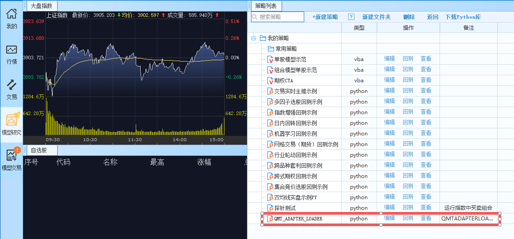
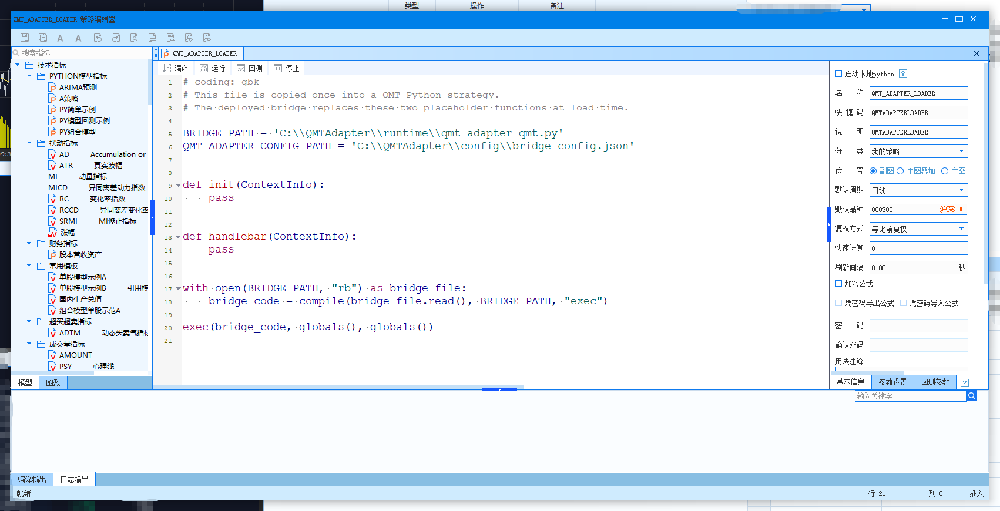
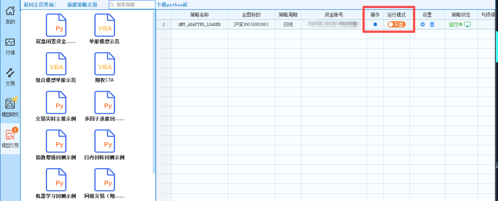

# QMTAdapter

由于交易接入环境变化，许多原本运行于 MiniQMT 的量化策略需要迁移至大 QMT。为了降低迁移及后续维护成本，同时保持策略代码的独立性和灵活性，本项目提供了一套基于大 QMT 的交易适配方案。

项目由大 QMT 端桥接脚本和外部 Python 客户端库组成。策略侧无需导入或直接调用 QMT Python API，即可通过统一接口完成账户查询、持仓查询、股票委托、委托查询和撤单等操作。

欢迎试用。如遇问题或有改进建议，请提交 Issue。

## 已成功测试客户端

- 东北证券NET专业版v2.1.19.0
- 东北证券NET专业版v1.0.0.38788
- 平安证券量盈QMT策略交易平台v2.1.17.0

## 当前功能

- 股票账户查询；
- 股票持仓查询；
- 单只及批量证券行情查询（可选返回QMT原始行情）；
- 普通现金账户股票买入和卖出；
- 北交所普通股票委托（买入不少于100股，之后可按1股递增）；
- 指定时间间隔串行批量下单；
- 沪深北交易所原生股票市价申报（按各市场支持的申报类型校验）；
- 沪深交易所国债逆回购；
- 当日新股、新债发行信息及账户申购额度查询；
- 新股、新债申购；
- 委托查询和撤单；
- 当日成交查询，可选择仅查询本Adapter委托或查询账户全部成交；
- 由QMT委托/成交回报驱动的单笔和批量委托状态等待；
- 按盘口流动性拆分并按固定间隔提交大额股票委托，支持预览、提交、查询和撤单。

## 安装与部署

### 1. 安装外部 Python 库

克隆仓库，在仓库根目录创建虚拟环境并安装：

```powershell
git clone https://github.com/fzyxh/QMTAdapter.git
Set-Location QMTAdapter
python -m venv .venv
.\.venv\Scripts\python.exe -m pip install -e .
```

`qmt_adapter` 安装在该虚拟环境中。外部策略通过它调用大 QMT，不需要导入 QMT
Python 模块。

### 2. 生成配置和 QMT 端脚本

首次部署时传入股票资金账号：

```powershell
.\.venv\Scripts\qmt-adapter.exe deploy --account-id YOUR_ACCOUNT_ID
```

部署及 QMT 策略首次启动后使用以下目录：

```text
C:\QMTAdapter\
├── qmt_adapter_loader.py
├── runtime\qmt_adapter_qmt.py
├── config\bridge_config.json
└── data\
    ├── bridge.db
    ├── bridge.db-wal
    └── bridge.db-shm
```

部署目录固定为 `C:\QMTAdapter`，与券商软件安装目录无关。配置文件和随机鉴权令牌
在首次部署时生成；SQLite 数据库在 QMT 策略首次启动时创建。单条协议消息默认
上限为5 MiB。

### 3. 在大 QMT 创建并启动策略

1. 打开大 QMT 的“模型研究”，新建 Python 策略。

   

2. 将 `C:\QMTAdapter\qmt_adapter_loader.py` 的完整内容复制到策略代码中并保存。

   

3. 打开“模型交易”，点击“新建策略交易”，策略类型选择刚才创建的策略。
4. 账户类型选择“股票账号”，资金账号选择部署时填写的同一账号。
5. 主图代码可填写 `000300`，运行周期选择“日线”。主图不决定实际交易标的。
6. 创建后将运行模式切换为“实盘”并启动策略。这里的“实盘”是 QMT 的策略运行
   模式，不代表所选资金账号一定是真实账户。

   

7. 确认 QMT 日志出现：

```text
QMT Adapter bridge is ready: \\.\pipe\qmt_adapter
```

短加载器只在策略启动时读取一次完整 Bridge，不会在每次查询或下单时重复加载。

### 4. 验证账户和持仓

保持 QMT 策略运行，在仓库根目录执行：

```powershell
.\.venv\Scripts\python.exe .\scripts\query_account.py --account-id YOUR_ACCOUNT_ID
```

能够返回 Bridge 状态、账户资金和持仓即表示部署成功。其他辅助脚本的用途和运行
方式见 [`scripts/README.md`](scripts/README.md)。

### 5. 升级

安装新版代码后执行：

```powershell
.\.venv\Scripts\qmt-adapter.exe deploy
```

该命令更新加载器和 Bridge，不覆盖账号、鉴权令牌及数据库。完成后停止并重新启动
QMT 策略，使新代码生效。

## 交易验证

调用下单或撤单接口时，大 QMT 策略必须使用交易运行模式。

盘口流动性加权拆单使用独立的 `algorithm` 字段，不属于
`STOCK_PRICE_TYPES`。算法生成的每笔子单都是明确价格的 `LIMIT` 委托。
建议先预览，再提交同一个请求对象：

```python
from qmt_adapter import AlgoOrderRequest, QmtClient


order = AlgoOrderRequest(
    account_id="YOUR_ACCOUNT_ID",
    instrument="601919.SH",
    side="BUY",
    target_amount="10000000",
    algorithm="BOOK_LIQUIDITY_WEIGHTED",
    remark="liquidity-example",
)

with QmtClient() as client:
    preview = client.preview_algo_order(order)
    assert preview["planned_quantity"] == preview["resolved_quantity"]
    receipt = client.place_algo_order(order)
    current = client.get_algo_order(receipt.algo_order_id)
```

`preview_algo_order()` 只从大 QMT 模型上下文读取当前买卖五档、最新价、昨收、
涨跌停价、最小价位以及账户资金或可用持仓，并返回实时涨跌幅和动态价格笼子；
不连接外部 `xtdata`，不写数据库且不调用 `passorder`。
`place_algo_order()` 会重新读取即时盘口并执行，所以预览与实单的价格和数量可能
随行情变化。

普通批量下单直接复用单笔委托接口。`interval_ms` 表示相邻两笔调用开始时间的
最小间隔，整批始终串行提交：

```python
from qmt_adapter import OrderRequest, QmtClient


orders = [
    OrderRequest(
        account_id="YOUR_ACCOUNT_ID",
        instrument="601919.SH",
        side="BUY",
        quantity=100,
        price_type="COUNTERPARTY",
        remark="batch-%02d" % index,
    )
    for index in range(10)
]

with QmtClient() as client:
    receipts = client.place_orders(
        orders,
        interval_ms=50,
        wait_for="LOCAL_ACK",
        timeout=10.0,
    )
```

查询当日新股新债、账户申购额度并申购：

```python
from qmt_adapter import NewIssueSubscriptionRequest, QmtClient


with QmtClient() as client:
    issues = client.list_new_issues("ALL")
    quota = client.get_new_issue_quota("YOUR_ACCOUNT_ID")
    receipt = client.subscribe_new_issue(
        NewIssueSubscriptionRequest(
            account_id="YOUR_ACCOUNT_ID",
            instrument="申购代码.SH",
            issue_type="STOCK",  # 新债使用 BOND
            quantity=1000,
            remark="ipo-example",
        ),
        wait_for="BROKER_ID",
    )
```

逆回购按人民币金额填写，必须为1000元整数倍；Bridge 会按每张100元标准券
转换成 QMT 使用的张数，因此1000元对应 `volume=10`：

```python
from qmt_adapter import QmtClient, ReverseRepoRequest


with QmtClient() as client:
    receipt = client.place_reverse_repo(
        ReverseRepoRequest(
            account_id="YOUR_ACCOUNT_ID",
            instrument="204001.SH",
            amount=10000,
            annual_rate="1.80",
            remark="repo-example",
        ),
        wait_for="BROKER_ID",
    )
```

申购价由 QMT 当日发行数据确定；接口不会自动选择标的或按额度满额申购。
逆回购和申购均复用普通委托的 `client_order_id`、查询、撤单和幂等规则。

## Asyncio 客户端

`AsyncQmtClient` 使用一个工作线程和一条命名管道连接。调用按提交顺序串行执行，
不会并行调用 QMT API。

```python
import asyncio

from qmt_adapter import AsyncQmtClient, OrderRequest


async def main():
    async with AsyncQmtClient() as client:
        order = OrderRequest(
            account_id="YOUR_ACCOUNT_ID",
            instrument="600000.SH",
            side="BUY",
            quantity=100,
            price_type="COUNTERPARTY",
            remark="async-example",
        )
        receipt = await client.place_order(
            order, wait_for="BROKER_ID", timeout=10.0
        )
        print(receipt.client_order_id, receipt.qmt_order_id)


asyncio.run(main())
```
